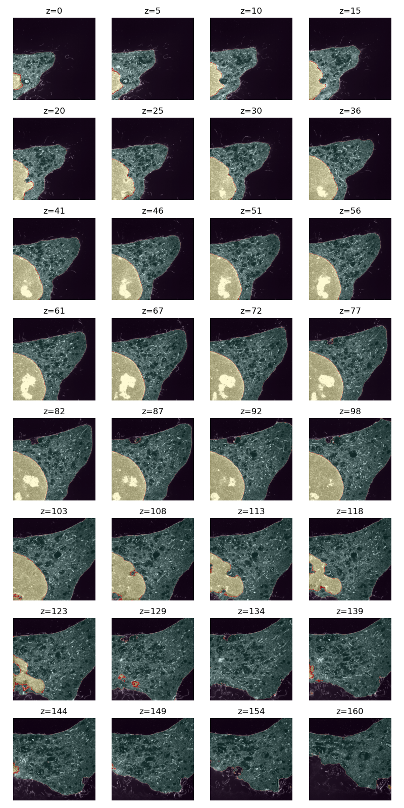

# Nucleus Segmentation for PanVision
---

This is a small repo that collects the training script to generate a small 3D UNet that is capable of segmenting the nucleus, cytoplasm and background for HeLa cells imaged with the PanExM protocol. 
A pretrained model can be found [here](https://drive.google.com/drive/folders/1hziGW7KhJJamqSZKYRiE0BTvMJCi43xn?usp=share_link)

